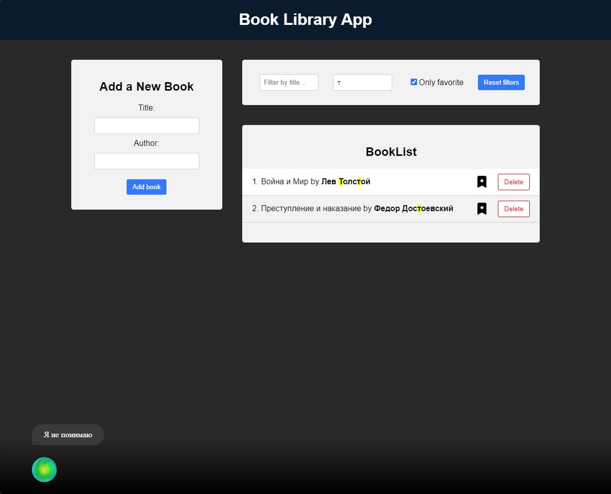
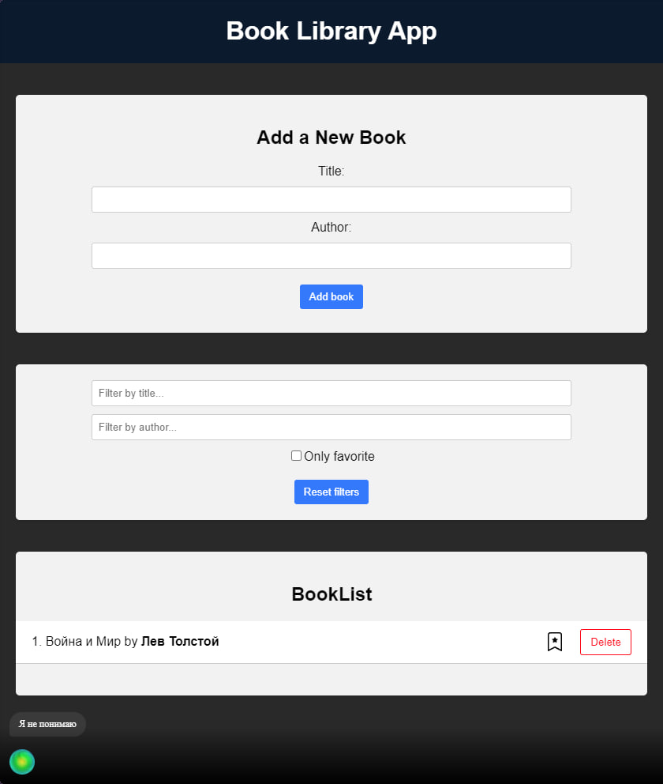

# <b>SberLib</b>
Веб-приложение ***SberLib*** является удобным сервисом, представляющим из себя библиотеку, где пользователь может записывать данные о том, какие книги он прочитал или хочет прочитать.

___

## Функционал
Пользователь имеет возможность отмечать любимые книги, сортировать их по разным критериям и производить разного рода фильтрации со своей библиотекой.

Далее будет более подробно перечислен функционал, доступный пользователю:
```
* Добавление книг
* Удаление книг
* Добавление книги в "Избранное"
* Сортировка списка по критериям
```

<p align="center">
 
</p>

<p align="center">
 
</p>

Выше представлены фотографии с примером работы **веб-приложения**.
___

## Возможности использования

Приложением можно будет пользоваться как на телефоне, так и на телевизоре с использованием продукции Sber.

Доступны **голосовой ввод**, управление **пультом** и **клавиатура/мышь**. 

